**Installation**
```bash
npm install -g @google/gemini-cli
npm upgrade -g @google/gemini-cli
```

**Once done, I suggest that you check the Gemini CLI version as follows:**
Let’s get back to the options. The -v or --version is straightforward and we did check that out in the first part. Currently, at the time of writing, here is my Gemini CLI version.
```bash
gemini -v
```

Go ahead and launch Gemini CLI via the gemini command. Keep in mind that this is a client running in your terminal, so be comfortable with using the keyboard (Arrow keys, etc).

It would first ask you about choosing a theme. Go ahead and select one that you like:

---

Go with the Google login, which will provide you access to the free tier of Gemini CLI, which allows for 60 requests/minute, 1000 model requests per day. This will invoke the browser, where you will need to login with your Google credentials for the account that you wish to use here. Once done, you should see `Gemini CLI` waiting for your command

---
Alternately, if you need higher quota, feel free to provide your Gemini API Key or even Vertex AI, where you may have a Google Cloud Project with billing enabled. Do refer to the Authentication section of the documentation.


### With Auth (connect with google account)
* first run this command

```bash
gemini
```
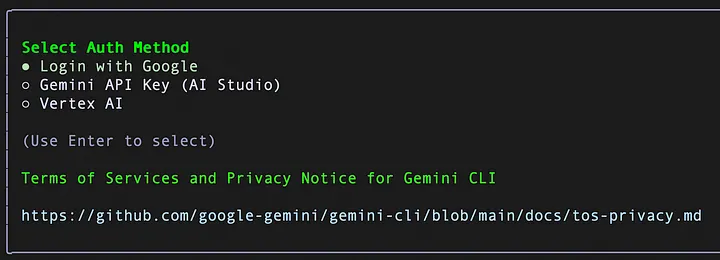

---

**check all command**
```bash
/help
```

#### Available Gemini CLI Tools
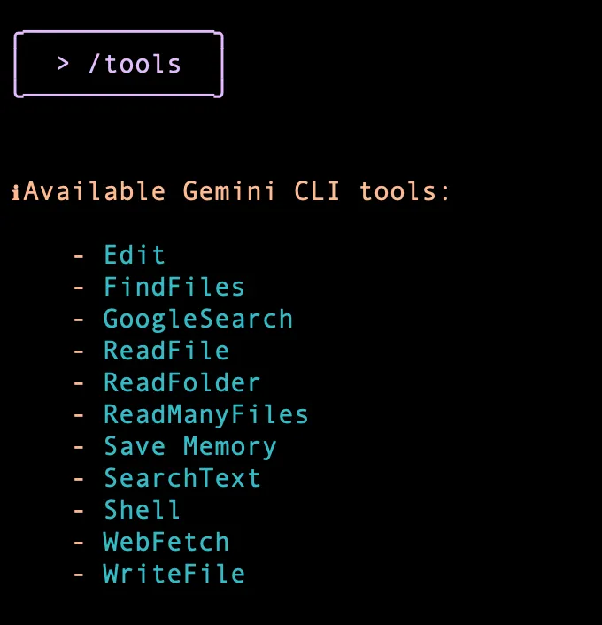

**It says shell mode enabled and I am typing the pwd command to understand where I am. The output is shown as below:**

You can come out of the terminal mode, by hitting ESC key.

You can quit Gemini CLI via the /quit command and then ensure that you are in the folder that you would like to be and then launch gemini from there.


#### model sweetch
Currently, I know of 2 models that one can specify to the Gemini CLI while starting up: gemini-pro-2.5 and gemini-flash-2.5. This is specified via the -m or--modelparameter as shown below.

While this is good, here is what I have seen happen and its understandable in the free tier. If you are using the free tier of Gemini CLI with your personal Google account, you will find that even if you choose the gemini-2.5-pro model, the CLI adjusts to the gemini-2.5-flash model due to quota issues. So be prepared for that. This can be addressed to the best of my knowledge by switching over to using your own Gemini API Key. You might see a debug message that looks like this.

```bash
genimi --model genini-2.5-flash

or

genimi --m genini-2.5-flash
```

#### Shell mode enabled
```bash
! --> esc to disable
```

### Simple Project with Agent Call

```bash
1-> mkdir cli_session
2-> gemini --model gemini-2.5-flash
3-> create a project with python and uv to build a simple calculator (agent command)
```


#### Permission Always Allow (Yolo Mode)
```bash
gemini --model gemini-2.5-flash --yolo

or 

gemini --model gemini-2.5-flash --y

or 

Ctrl C (shortcut command) 
```
* koe bhi kam krega agent  ko kisi point pr permission nh mangyga.


#### File open in terminal
* goto shell mode (!) and run this
```bash 
cat kids.md
```

<!-- #### Debug
```bash
gemini --model gemini-2.5-flash --debug
```

**Run Command**
* you can check model and tools stats
```bash
/ stats
``` -->

#### Session Exit (run command in shell)
```bash
/quit
```

### Basic Cmd Commands
| Command         | Description                                          |
| --------------- | ---------------------------------------------------- |
| `dir`           | Lists all files and folders in the current directory |
| `cd foldername` | Opens (changes to) the specified folder              |
| `cd ..`         | Goes back one folder level                           |
| `cls`           | Clears the screen                                    |
| `exit`          | Closes the Command Prompt                            |


#### you and use without session start(personal Asiatant)
How about executing Gemini CLI in a way that it does not bring up the terminal interface. Instead, it just takes your prompt, executes it and gives back the result. This is known as the non-interactive mode.

This can be very useful in scenarios where you want to integrate Gemini CLI in automated pipelines or schedule something at a specific time, without the need for any human interface. This is flexibility of the Gemini CLI interface where its not just about running something inside of a terminal but can be integrated in various other scenarios and execution modes too.

So coming back to what we wanted to try? In case you have a need to simply prompt the Gemini CLI and do not require the terminal interface to come up, try the -p or the --prompt option, as shown below:

```bash
gemini "what latest news from openai"
```
**or**
```bash
gemini -p "What is the command line syntax for doing a GET call to myhost.com via curl"
```
gemini -p "What is the command line syntax for doing a GET call to myhost.com via curl"

This might be a good way to get some quick answers but do keep in mind that there is be no scope to continue the conversation with follow up questions.


### d stands for debug
You might not need this option ideally but in case you are reporting an issue or even to understand a bit about what is going on, its helpful to see what happens when we use the debug flag i.e. -d or --debug

First, let me show you the -d option while a single prompt (using -p) at the command line. Before I go into launching the Gemini CLI and its output, let me describe the current folder that I am in and its contents. This is important for you too.

I am launching Gemini CLI from /Users/romin/gemini-cli-projectsfolder. This folders has several folders, which contain apps that I have generated using Gemini CLI itself.

```bash
gemini -d -p "What is the Linux command to move files recursively from one folder to another. Give me an example or two"
```

This results in the following output. I have truncated some of the file listings, so that we keep the focus on what is going on. A better understanding of this output is critical so that you can understand the hierarchy in which Gemini CLI looks at certain files to load in order to setup the context (hint : GEMINI.md)

```bash

[DEBUG] [MemoryDiscovery] Loading server hierarchical memory for CWD: /Users/romin/gemini-cli-projects/cli-series (importFormat: tree)
[DEBUG] [MemoryDiscovery] Searching for GEMINI.md starting from CWD: /Users/romin/gemini-cli-projects/cli-series
[DEBUG] [MemoryDiscovery] Determined project root: None
[DEBUG] [BfsFileSearch] Scanning [1/200]: batch of 1
[DEBUG] [BfsFileSearch] Scanning [3/200]: batch of 2
[DEBUG] [BfsFileSearch] Scanning [6/200]: batch of 3
[DEBUG] [BfsFileSearch] Scanning [8/200]: batch of 2
[DEBUG] [BfsFileSearch] Scanning [9/200]: batch of 1
[DEBUG] [BfsFileSearch] Scanning [24/200]: batch of 15
[DEBUG] [BfsFileSearch] Scanning [39/200]: batch of 15
[DEBUG] [BfsFileSearch] Scanning [54/200]: batch of 15
[DEBUG] [BfsFileSearch] Scanning [69/200]: batch of 15
[DEBUG] [BfsFileSearch] Scanning [84/200]: batch of 15
[DEBUG] [BfsFileSearch] Scanning [99/200]: batch of 15
[DEBUG] [BfsFileSearch] Scanning [114/200]: batch of 15
[DEBUG] [BfsFileSearch] Scanning [129/200]: batch of 15
[DEBUG] [BfsFileSearch] Scanning [144/200]: batch of 15
[DEBUG] [BfsFileSearch] Scanning [159/200]: batch of 15
[DEBUG] [BfsFileSearch] Scanning [174/200]: batch of 15
[DEBUG] [BfsFileSearch] Scanning [189/200]: batch of 15
[DEBUG] [BfsFileSearch] Scanning [196/200]: batch of 7
[DEBUG] [BfsFileSearch] Scanning [198/200]: batch of 2
[DEBUG] [MemoryDiscovery] Final ordered GEMINI.md paths to read: []
[DEBUG] [MemoryDiscovery] No GEMINI.md files found in hierarchy of the workspace.
Flushing log events to Clearcut.
Session ID: d8955cf4-64d7-46b7-a50c-b89b5aaaeb9e
The most common and safest way to recursively move files is to use `cp` (copy) followed by `rm` (remove). A more direct but potentially less flexible method for simple cases is `mv`. For more complex or large-scale moves, `rsync` is the best tool.

### 1. Using `cp` and `rm` (Safest Method)

This approach ensures the files are successfully copied to the destination before you delete the originals.

**Command:**
cp -r /path/to/source/* /path/to/destination/
rm -r /path/to/source/*

**Explanation:**
*   `cp -r`: Recursively copies files and directories.
*   `/path/to/source/*`: The `*` ensures you copy the *contents* of the source directory.
*   `/path/to/destination/`: The directory where you want to move the files.
*   `rm -r`: After copying, this command recursively deletes the original files.

### 2. Using `mv` (Simpler Method)

The `mv` command moves files and directories. When you use it on a directory, it moves the entire directory and its contents.

**Example 1: Move the contents of one folder into another**

This moves all files and subdirectories from `source` into `destination`.

**Command:**
mv /path/to/source/* /path/to/destination/

**Example 2: Move the entire source folder into another folder**

This will result in `/path/to/destination/source`.

**Command:**
mv /path/to/source /path/to/destination/

### 3. Using `rsync` (Most Robust Method)

`rsync` is excellent for moving large numbers of files. It's efficient and provides progress information.

**Command:**
rsync -av --remove-source-files /path/to/source/ /path/to/destination/

**Explanation:**
*   `-a`: Archive mode (recursively copies, preserves permissions, times, etc.).
*   `-v`: Verbose (shows progress).
*   `--remove-source-files`: Deletes the original files after they are successfully transferred, effectively performing a "move".
*   **Note the trailing slash on `/path/to/source/`**: This is important. It tells `rsync` to copy the *contents* of the source directory, not the directory itself.
view rawgemini-cli-debug-output.txt hosted with ❤ by GitHub
```

You will notice that the Gemini CLI starts building up a context and tries to find the GEMINI.md file. It keeps looking recursively till it has reached the root. At the moment, I do not have any GEMINI.md file and hence it could not find that. But if it did, it would have found all the GEMINI.md files and concatenated them to create, as the documentation states “instructional context (also referred to as “memory”) provided to the Gemini model. This powerful feature allows you to give project-specific instructions, coding style guides, or any relevant background information to the AI, making its responses more tailored and accurate to your needs”.

We will get to the GEMINI.md file a bit later, but here are a couple of things that I believe you should understand if using the Gemini CLI tool.


Purpose: These Markdown files contain instructions, guidelines, or context that you want the Gemini model to be aware of during your interactions. The system is designed to manage this instructional context hierarchically.

We have quickly established the fact that we may want multiple GEMINI.md files and earlier, we have highlighted that Gemini CLI will find all of them and concatenate them together into a single instructional set that it will use. Content from files lower in this list (more specific) typically overrides or supplements content from files higher up (more general).

Context is loaded from three main levels, moving from broadest to most specific:
* Global Context File : A GEMINI.mdfile in your home directory for rules across all projects. This is a special directory named ~/.gemini.
* Project and Ancestors Context Files: Files in the project’s root directory for project-wide rules.
* Local Context Files: Files in sub-directories for highly specific instructions about a particular module or component.

That brings us back to the output that we got from the -d (debug) command and do note that while I did not have any GEMINI.md, you can see how it went about searching for it.

Let’s see what happens when we launch the Gemini CLI without the -p option but with just the -d option. We launch it as follows:

```bash
gemini -d
```

At this point, if I do a /memory show command, I can see the current context, what files were loaded, etc. This is very useful to understand if the context was loaded correctly. While I do not have a GEMINI.mdfile at the moment, due to which there is nothing available as per the output below.
<br>

```bash
/memory --> show >> list >> add >> refresh
```

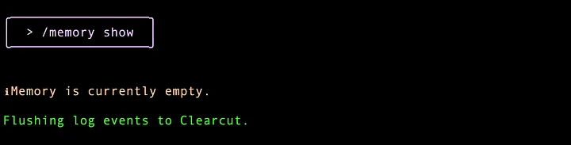

If you happen to have a GEMINI.md file, modify it outside, you can always refresh it via the /memory refresh command. Try that command right now and see the similar debug statements that come up.

Whew ! That was a lot of discussion just for debug. But do keep this option handy. In case you are reporting any specific issues that you find, it might be handy to turn on the debug mode and see what is going on.


### Check Stats
Stats humy ye batata ha ke ki model or tools ki kitni request gai ha..
```bash
/stats
```

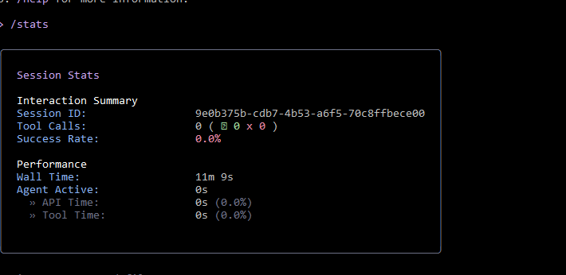


### Let’s have a checkpoint
This is an interesting but an essential feature. Imagine you are going on with the Gemini CLI and it has used tools to write to file, etc. But something goes wrong and you would like to get back to the previous good state. That’s the checkpointing feature, which as the documentation states “automatically saves a snapshot of your project’s state before any file modifications are made by AI-powered tools. This allows you to safely experiment with and apply code changes, knowing you can instantly revert back to the state before the tool was run.”

By default, when you launch the Gemini CLI, checkpointing is not enabled and you will need to enable it via the -c or --checkpointing flag, when you launch it.


Let’s see this feature in action. First up, I have a small Go project. It is a command line utility that takes a sample text file and it provides the number of characters, words and lines in the text file. So I am in that current folder that has a main.go file and a sample file to test test.txt. This is also a Git enabled folder and I have committed main.go, test.txt and go.mod.

I launch Gemini CLI with the checkpointing and debugging enabled as given below:

```bash
gemini -c -d
```

The status bar clearly shows that I am in --debugmode and the folder along with the Git branch are shown.
<br>

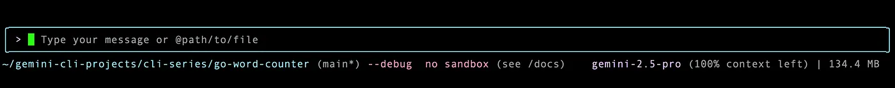

* Let’s run a shell command via the ! to just validate a few things.
* So I have run some commands, the (pwd) and the (ls), (cd), (dir) command:
<br>

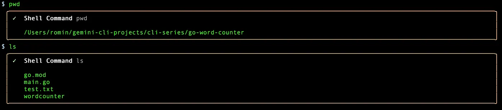
* Hit ESC key to come out of the Shell mode.

At this point, there is nothing to restore or go back to. If you need to restore back to some point, you do that via the /restore command. If you just use the command as is, it says that there are no restorable tool calls found. And this is fair since we have not asked Gemini to do any task, that resulted in things like creating folders, writing files, etc.

<br>

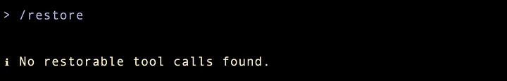

<br>

Everything looks good. Let’s use the Gemini CLI to now generate a README.md file for this project. I give the following command:

<br>

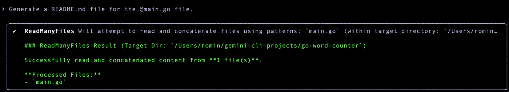

<br>

If you now run the command /restore, you can see that there is a checkpoint that it is generated. As per the documentation “these file names are typically composed of a timestamp, the name of the file being modified, and the name of the tool that was about to be run (e.g., 2025–09–10T06–56–49_549Z-README.md-write_file).

* Make Sure krna ha Checkpointing Enabled ho warna /restore command work nh krygi(gemini -m gemini-2.5-flash -c)
<br>

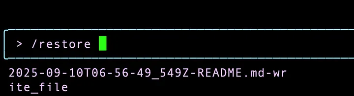

<br>

Before we make another change to the README.md file, let us see where the checkpoint data is being stored? Go to the home directory (e.g. ~ on my Mac). This will have a .gemini/tmp folder. Expand that to see a folder that will contain your logs, shell history and checkpoints. A sample for the above operations that we have done is shown below:

<br>

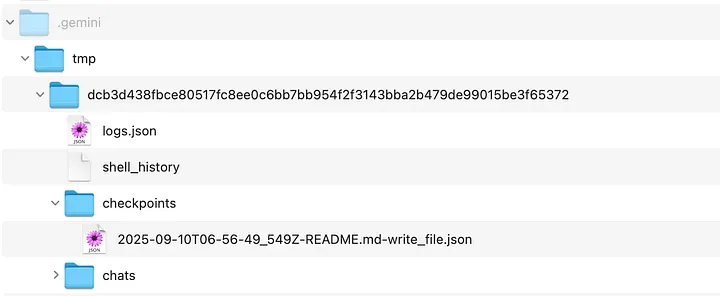

<br>

If you click on the checkpoints file (2025–09–10T06–56–49_549Z-README.md-write_file.json) you will see the details for the interaction that has happened so far.

Cool ! Let’s make another change in the README.md file that we have. At the top, the title reads Go Word Counter. I would like this to be changed to File Stats utility.

The prompt is: In the @README.md file, change the title to “File Stats Utility”

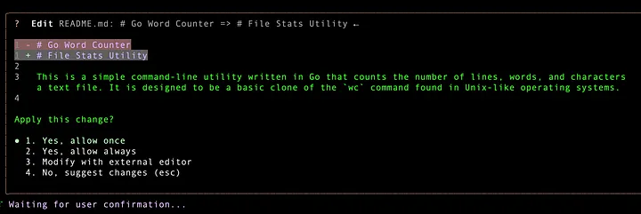

It does a good job and it’s asking me to apply the change, which I am ok with. It says that it has completed the task and at this point, if I go to shell mode and ask it to print out README.md, I can see that it has done that:

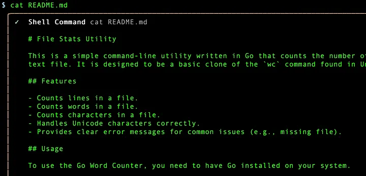

Let’s use the /restore command now to see if another checkpoint has been created and indeed there is one:

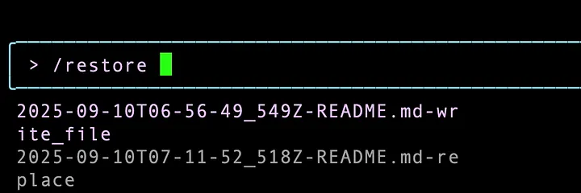

So we can see that we have two checkpoints, one for the README.md file creation and the other for the task that replaced the title.

At this point, if you observe the .gemini/tmp/<CHECKPOINT> specific folder as explained above, you will see that there are two checkpoints now:

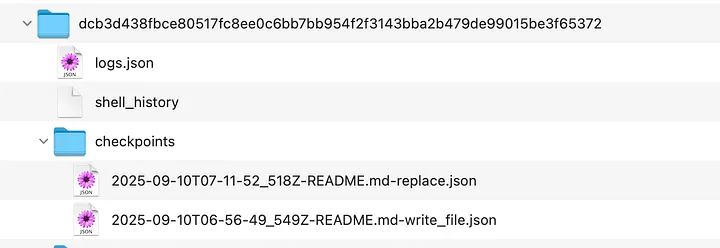

Use the /restore command and you can now scroll through any of the checkpoints and go back to that state. So I can just go to say the second one , which only replaced the title and get it back to the original title i.e. Go Word Counter.

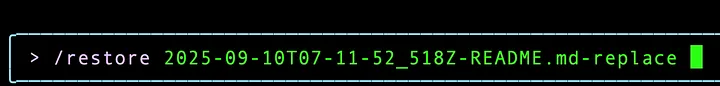

I do that and this is important, it shows me the changes that were done at this step, which I want to revert. So when it asks me for permission, I select No, suggest changes option and I am back to my previous state.


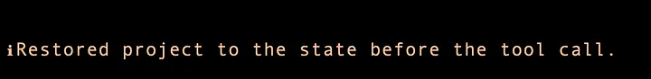

If I view the contents of the README.md file, I see the following:

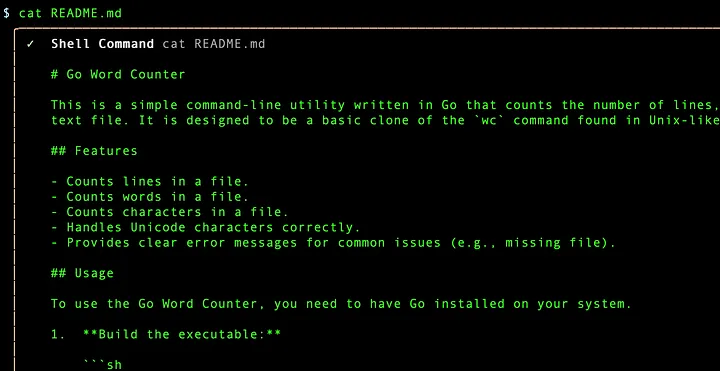

Remember that Checkpointing is not available by default, so you need to provide the checkpointing flag when you start the Gemini CLI or better still, if this is a feature that you absolutely want running all the time, then you can put that in the settings.json file, which we shall see in the next part of this series.


### Session summary
If you are looking for your session summary to be persisted, which you can then look into, you can try the--session-summary parameter.

Launch it as follows: gemini --session-summary "session.txt"

This will launch Gemini CLI and keep a track of the. A sample run for my project folder and a couple of interactions to get the list of files and to get an explanation for a file is shown below:

```bash
{
  "sessionMetrics": {
    "models": {
      "gemini-2.5-pro": {
        "api": {
          "totalRequests": 1,
          "totalErrors": 0,
          "totalLatencyMs": 9119
        },
        "tokens": {
          "prompt": 7068,
          "candidates": 131,
          "total": 7816,
          "cached": 0,
          "thoughts": 617,
          "tool": 0
        }
      },
      "gemini-2.5-flash": {
        "api": {
          "totalRequests": 1,
          "totalErrors": 0,
          "totalLatencyMs": 3589
        },
        "tokens": {
          "prompt": 5853,
          "candidates": 82,
          "total": 6009,
          "cached": 0,
          "thoughts": 74,
          "tool": 0
        }
      }
    },
    "tools": {
      "totalCalls": 0,
      "totalSuccess": 0,
      "totalFail": 0,
      "totalDurationMs": 0,
      "totalDecisions": {
        "accept": 0,
        "reject": 0,
        "modify": 0,
        "auto_accept": 0
      },
      "byName": {}
    },
    "files": {
      "totalLinesAdded": 0,
      "totalLinesRemoved": 0
    }
  }
}
```

It provides you information on the model used, the calls based, the tokens used and more. You could possibly use these metrics, aggregate in a central place for your own analysis.

The data in session.txt file is similar to the one that you get on stats command inside of Gemini CLI. Alternately, if you /quit Gemini CLI, you get a summary too, that looks similar. A sample summary shown when I quit the above session is shown below:


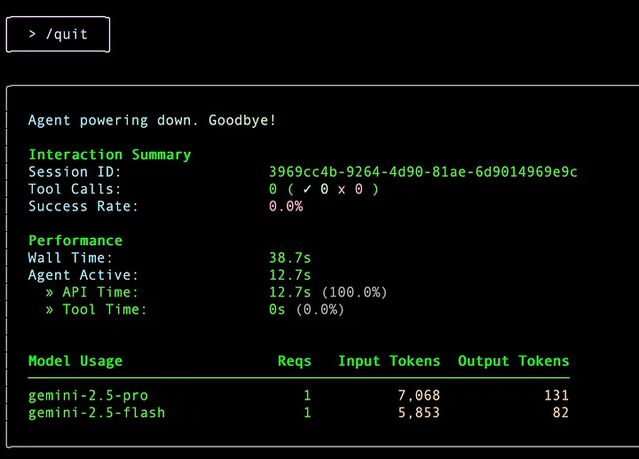