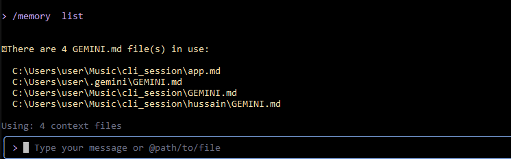

#### Gemini CLI Tutorial Series — Part 3 : Configuration settings via settings.json and .env files
In Part 1, we installed Gemini CLI and our first few prompts. Then, in Part 2, we took a deep dive with command-line parameters (flags), learning how to control a single CLI session with options like --checkpointingand more.

But what if you don’t want to type --checkpointing every single time you launch the CLI? What if your team has a specific set of coding standards you want Gemini to follow for a particular project? These two questions address User Settings that apply to each project and Project / Workspace Settings that apply to specific projects. In addition to this, you would like that these settings are persistent.

Enter settings.json, a configuration file, where you can define your preferences once and have them apply automatically at the time of starting Gemini CLI.

In this part of the series, we'll explore the different locations for settings.json, understand the order of precedence for how settings are applied and cover a few of these configuration parameters. Some of the stuff around MCP Tools, we will leave it to another part in the series.

### Global(User) & Local (Project) settings
At its core, the Gemini CLI is designed to be context-aware. Its behavior can change based on whether you’re setting a personal preference that applies everywhere or project-wide / workspace-wide standard, that may apply to a specific folder. This implies that there are two distinct settings.json files. I might also use the word project or workspace interchangeably.

### Global (User) Settings
The first place Gemini CLI looks for settings is in your home directory. You will find a .gemini folder and inside it expects a settings.json file.

In summary, the file is located at ~/.gemini/settings.json and if you have launched Gemini CLI, it is created for you the first time you do that.

This file is for your personal preferences that should apply across all your projects. Possible configurations that you can provide in this file include selecting a theme that you prefer, your authentication method, a preferred Editor, that you’d like to use every time.

agr me apny project ki root directory me GEMINI.md create kro. or project mehe kisi folder me same name ki dusri
GEMINI.md create kroga to dono GEMINI.md files context ka part banegy. qk gemini cli GEMINI.md file ko find krke
context me bhjta ha. agr ap chahty ha kisi dusri file ko bhi context ka part banaye jasy app.md, readme.md etc.

#### create folder & file in (your project root directory) .gemini/settings.json
```bash
{
    "context": {
        "fileName": ["app.md", "GEMINI.md"]
    }

}
```



### Local (Project / Workspace) Settings
The second location is within your project’s root directory. By creating a .gemini/settings.json file inside your project folder, you can define a configuration that applies only when you run the gemini command from within that project's directory or its subdirectories.

The good thing is that you can check in this file in your version control and ensure that not just you but even other project team members, get the same file that keeps their configuration consistent or same set of tools or even a project-specific GEMINI.md context file.


#### Configuration Precedence
This brings us to an important concept about how these configuration parameters will take effect and it is about understanding the precedence. Which settings.json file is given more preference? Can a command-line parameter override the value specified in any of the settings.json file?

* Configuration is applied in the following order of precedence (lower numbers are overridden by higher numbers):
* Default values: Hardcoded defaults within the application.
* System defaults file: System-wide default settings that can be overridden by other settings files.
* User settings file: Global settings for the current user.
* Project settings file: Project-specific settings.
* System settings file: System-wide settings that override all other settings files.
* Environment variables: System-wide or session-specific variables, potentially loaded from .env files.
* Command-line arguments: Values passed when launching the CLI.

I find this a bit confusing to read (lower numbers are overriden by higher numbers), so let me re-arrange this a bit (highest precedence is first):

1. Command-Line Arguments: The most specific override. An argument like gemini --checkpointing will always win for the current session, no matter what your settings.jsonfile may say.
2. Environment Variables: System-wide or session-specific settings. The GEMINI_API_KEY, GOOGLE_CLOUD_PROJECTis a prime example of an environment variable that takes precedence over file-based settings.
3. System settings file: You can have a scenario where in an organization, administrators may make use of these files to provide settings that override all other settings file. This is important so that users do not override mandatory settings that are set for the organization. If you are only working locally, then using a combination of Project settings file and User settings file (covered in the next two steps) should suffice.
4. Project (Workspace) Settings file /.gemini/settings.json: Rules defined for a specific project directory. These override your personal user settings.
5. User Settings file ~/.gemini/settings.json: Your personal defaults, which apply globally.
6. Gemini CLI Default Values: The hardcoded, out-of-the-box settings that the CLI ships with, such as the default model being "gemini-2.5-pro".

In the previous part, we covered Checkpointing that allows us to revert back to a known good state, in case our files are changed quite a bit and we have reached some sort of a deadend to resolve this. We saw that you could pass the --c or --checkpointing as a command-line parameter while starting Gemini CLI. You might just want to set it up for a specific project v/s for all projects or who knows, you might just prefer to have it for all projects.

So pick your preference and accordingly modify either the User or the Project settings.json file, with the following:

```bash
"checkpointing": {"enabled": true}
```

### Environment variables
In addition to providing certain configuration settings via command-line and settings.json file that we have seen, there are also environment variables that you can set as per the Operating System environment syntax or in .envfiles. These are best suited to store sensitive information like API Keys, Project Ids and more. But in the case of Gemini CLI, there are specific settings related to color, title and debug mode too.

You can get a list of variables that are supported in the .envfiles in the documentation here.

The thing to note again is that just like there were several settings.json files that you can have, the .env scene is similar and here is the order in which Gemini CLI searches for the files, as reproduced here from the documentation.

The CLI automatically loads environment variables from an .env file. The loading order is:

1. .env file in the current working directory.
2. If not found, it searches upwards in parent directories until it finds an .env file or reaches the project root (identified by a .git folder) or the home directory.
3. If still not found, it looks for ~/.env (in the user's home directory).

* GEMINI_API_KEY: In case you are using your own Gemini API Key, set the value via this environment variable.
* GOOGLE_CLOUD_PROJECT and GOOGLE_CLOUD_LOCATION: In case you are using Vertex AI or Code Assist, you will need to provide your Google Cloud Project Id and location here.
* GOOGLE_APPLICATION_CREDENTIALS: Those of who familiar with Google Cloud will recognize this environment variable. This variable might be set already via the gcloud auth application-default login command.
* GEMINI_MODEL: This specifies the default Gemini model to use. For e.g. “gemini-2.5-flash”

---
