# Gemini CLI Tutorial Series — Part 4 : Built-in Tools
Gemini CLI comes with a set of built-in tools and as the documentation states “Gemini model uses this tools to interact with your local environment, access information, and perform actions. These tools enhance the CLI’s capabilities, enabling it to go beyond text generation and assist with a wide range of tasks.”

When it comes to local environment, these are your local file folders, files in them. So for e.g. if you ask Gemini CLI to write code and save that file, it will need to interact with the local file system, current folder and create the file with the contents. If you provide a local folder and ask Gemini to examine the contents of all the files in that folder, then it will need tools to read the folder contents, read each file content and so on.

Its not just about the local environment but there are a few built-in tools that can access the internet, do Google Search based on your query, fetch the contents of a url and so on. Imagine you giving a prompt that says “Fetch the news from xyz site and summarize it for me”.

To get a list of current Built-in Tools, we need to simply invoke the /toolscommand as shown below:


<br>

One of the things that should strike you immediately is to ask if Gemini CLI can simply call these tools, when it wants to? The default answer is no, when it comes to sensitive operations that might involve writing to the local system, reading from an external system, going to the external network and so on. While there is a --yolomode available when you start the CLI (not recommended unless you are sure what you are doing) and a
--approval-mode that allows you to either prompt for approval or auto-approve edit tools, you will find that Gemini CLI will prompt you for permission to run the tool that it has chosen. You can refuse permission, or let it run once or give it blanket permission to always run. You are and should be in full control of things.


You can view the current directory at the bottom left of your Gemini terminal or you can go into shell mode by pressing ! and then giving the command : pwd in my case.
<br>

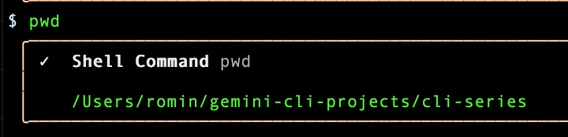

<br>
One of the tools listed above is the ReadFolder tool. Let’s try and see if Gemini can choose that tool correctly. We give it the following prompt:

```bash
Are there any files in the folder?
```

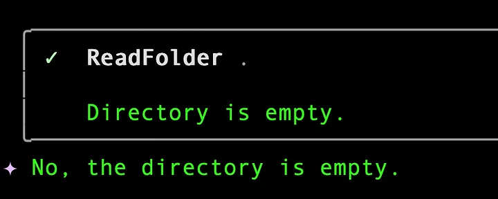

This was a simple demonstration of how it picked up the right tool to complete the task that we gave it to do i.e. find if there are files in the folder.

Let’s see the GoogleSearchtool in action. This tool as the name says performs a web search using Google Search via the Gemini API. It returns a summary of web results with sources.

We shall put it to the test here to get me some news in the finance world in India today and I would like it to save that information in a file named finance-news-today.txt. In order words, the prompt that I shall give should make Gemini CLI use 2 tools: GoogleSearch and WriteFile. Let’s make that happen. I give it the following prompt:

```bash
Search for the latest headlines in the Finance world in India 
and save them in a file named finance-news-today.txt
```
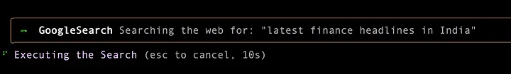

<br>

Then it is trying to write the file as we requested it and is now asking us for permission to use the WriteFile tool as shown below:

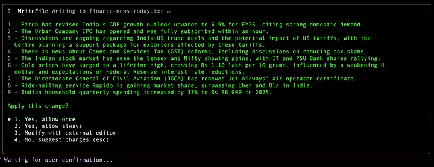

This sounds good and I allow it once. This enables Gemini CLI to use the WriteFile and the file is then created.

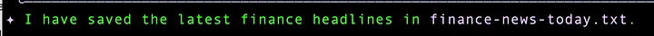

If I go into Shell mode and do a ls, I can see that the file has got created:


I continue my shell mode and print out the contents of this file.

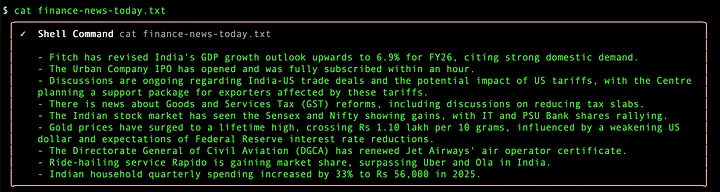


You can search through the file for specific content. For e.g. I am interested to see if there is any news around “GST”. I give the following prompt and get back the correct result as shown below.

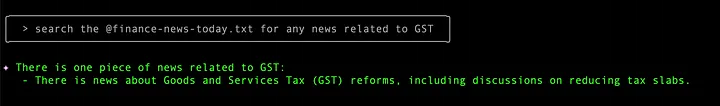

I ask next about what the WebFetch tool do?

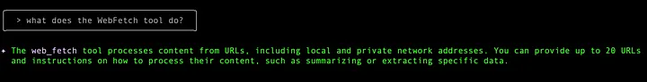

Cool. This means I could potentially ask it to view maybe a RSS Feed, extract out the content and then summarize it in some form. Let’s try that with the following set of prompts. First I ask it to search for a Google Cloud Blog RSS feed.

This gives back the following:
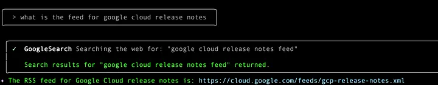

I give a follow up query to use that feed and to get the updates and summarize them for me for any release notes announced on September 9, 2025. Gemini CLI asks me for permission to use the WebFetch tool to get the content

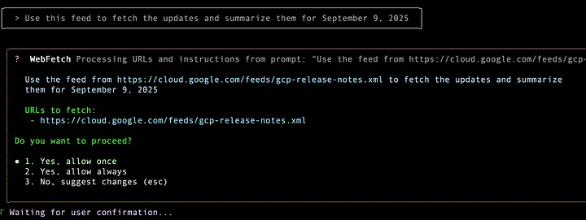

It does a great job and gets me the release notes for that datenews:


I then ask it to save this information by writing it to a file.

```bash
Fantastic. Write this information to a file named gcp-release-notes-sep9-2025.txt  │Its asking me for permission, which I grant:
```
I give it the required permission and and then we have our file created by Gemini CLI:

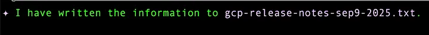

If I go in shell mode and do a ls, I get the two files listed now:

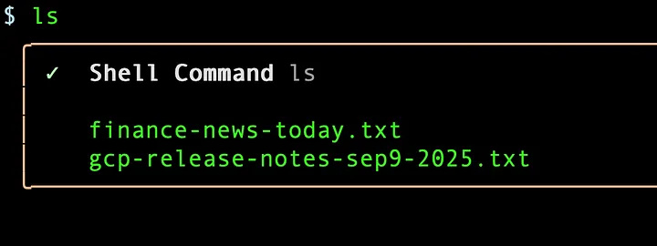

I can now even do things like convert one of these files to a Markdown (.md) format, as shown below. Its done the work and is asking me for permission to write the file:

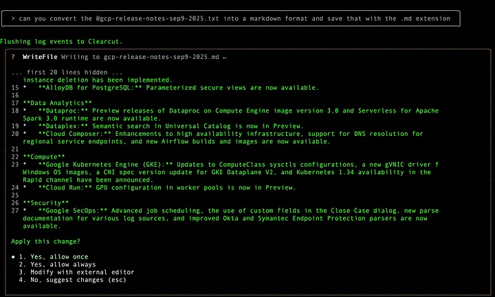

Here is the sample output where I list down the files and also print out the contents of the generated Markdown file, all done via the shell mode.


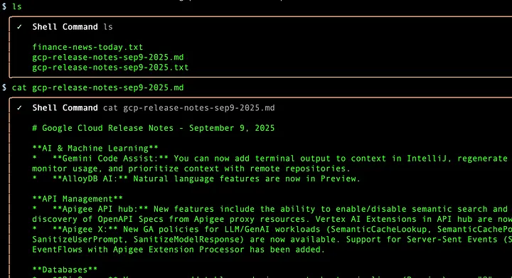


