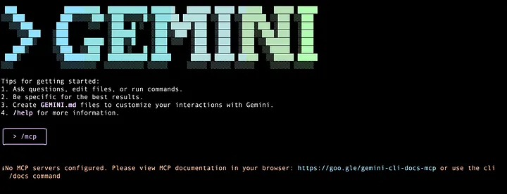
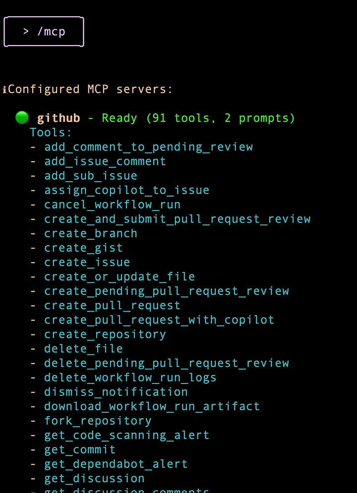
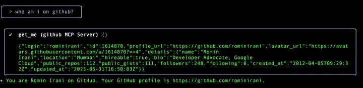
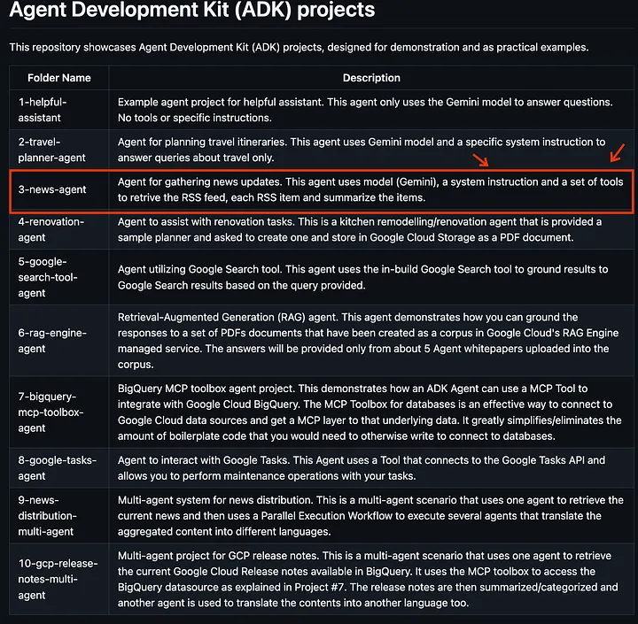

# Gemini CLI Tutorial Series — Part 5 : GitHub MCP Server

Model Context Protocol (MCP) has well established itself over the last year as the standard way for AI Clients to connect to external tools. This is not going to be a tutorial on MCP since there is enough material on the web to understand that. I am assuming that you know the value that MCP brings to the table and it was good to see that Gemini CLI supports MCP since its initial release. This means we can look at integrating MCP Servers to augment the functionality that Gemini CLI already has via its model and built-in tools.

This tutorial will take you through how we configure MCP Servers in Gemini CLI, a few commands then within Gemini CLI to work with them and along the way, we shall we setting up the Github official MCP Server and then doing a little exercise of seeing how Gemini CLI helped me fix a problem in my Github repo by detecting the problem, doing the fix and then pushing the changes back to the remote repository.

## Configuring MCP Servers
Before we get to the exact place you will configure MCP Servers, let’s get familiar first with the Gemini CLI and what happens on a system, where you have just installed Gemini CLI and no MCP servers have been setup yet.

I would also like to describe that I am currently in a folder named gemini-cli-projects in my home folder. I have setup Gemini to authenticate via Vertex AI and my GOOGLE_CLOUD_PROJECT and GOOGLE_CLOUD_LOCATION values have been setup in the .gemini/.env folder in the current folder i.e. gemini-cli-projects.

When I launch Gemini CLI, I can check up on the MCP servers configured via the /mcpcommand as shown below:




Let’s look at configuring a few MCP Servers now to understand how it all comes together.

There is one point to note before we configure a few of these servers. Gemini CLI is able to integrate with your host system, as a result of which, if you already have these utilities configured on your system, chances are good that Gemini CLI will be able to find them and execute them for you. So you will have to make a choice if you need to have the MCP Server or not. For e.g. if you already have git installed and setup on the host system, Gemini CLI should be able to invoke the commands

https://github.com/modelcontextprotocol/servers-archived/tree/main/src/github

**Add Github server (User/user/.gemini/setting.json) --> Root Folder**
```bash
{
  "mcpServers": {
    "github": {
      "command": "npx",
      "args": [
        "-y",
        "@modelcontextprotocol/server-github"
      ],
      "env": {
        "GITHUB_PERSONAL_ACCESS_TOKEN": ""
      }
    }
  },
  "security": {
    "auth": {
      "selectedType": "oauth-personal"
    }
  },
  "ui": {
    "theme": "Default"
  }
}
```
* Proifile --> Settings  --> Developer Settings --> personal access token -->  tokens (classic) and (Generate a new Token)

**Go to gemini cli and run**
```bash
/mcp
```
#### Some Command
- Use /mcp desc to show server and tool descriptions
- Use /mcp schema to show tool parameter schemas
- Use /mcp nodesc to hide descriptions
- Use /mcp auth <server-name> to authenticate with OAuth-enabled servers
- Press Ctrl+T to toggle tool descriptions on/off


### Github MCP Server
The Github official MCP Server provides sufficient documentation on the tools that it exposes along with how to configure the same. You can pick your choice in terms of running it locally or remotely, since Gemini CLI supports remote MCP Servers too.

The MCP Server object that we will need to put in the settings.json file is shown below:


```bash
"github": {
  "httpUrl": "https://api.githubcopilot.com/mcp/",
  "headers": {
          "Authorization": "<YOUR_GITHUB_PAT>"
        },
        "timeout": 5000
 }
 ```
My settings.json file in .gemini folder in the home directory looks like this now:

```bash
{
  "selectedAuthType": "vertex-ai",
  "theme": "Default",
  "mcpServers": {
       "github": {
            "httpUrl": "https://api.githubcopilot.com/mcp/",
            "headers": {
                "Authorization": "<MY_GITHUB_PAT>"
            },
            "timeout": 5000
       }
  }
}
```

Let me start Gemini CLI with this and I see the following on the home screen at startup (Notice that it says Using 1 MCP Server):

<br>



<br>

I tried out a little exercise to find out if it can use the tool to know who I am. It picks up the right tool get_me from the Github MCP Server and displays the required information, as shown below:

<br>



<br>

### Gemini CLI — Discover an issue automatically
I want to get around to doing something interesting with Gemini CLI and one of my repositories. So while it is not exactly just a MCP server configuration, its a nice little exercise to see the kind of stuff that Gemini can identify and fix for us too.

One of my repository is https://github.com/rominirani/adk-projects and it contains a bunch of Agent Development Kit (ADK) projects that I have created when I was learning the framework. I have a README.md file that has a list of all the folders, each of which contains a sample agent that has been developed using ADK.

The README.mdfile has a problem in that one of the descriptions / folder is incorrect. The current README.md file is shown here:
<br>



<br>

