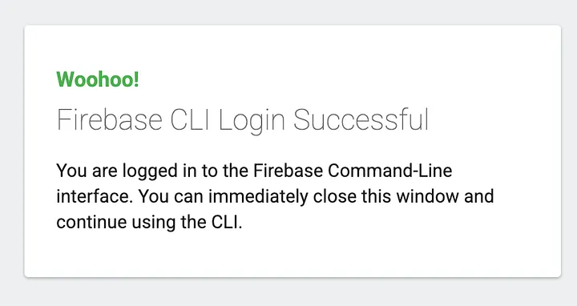
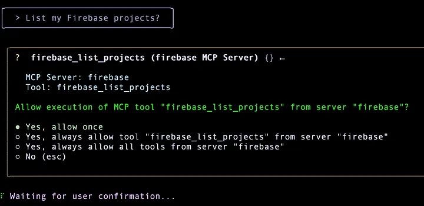
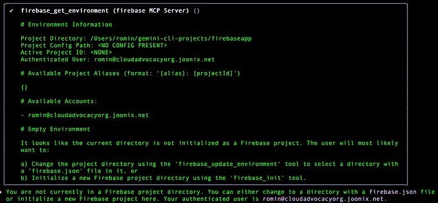
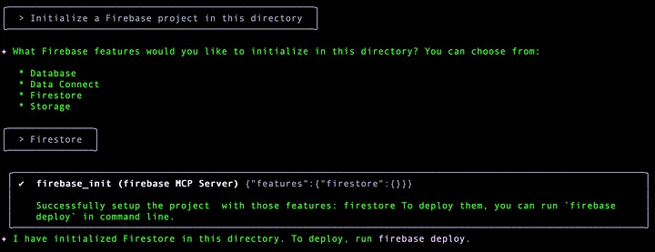
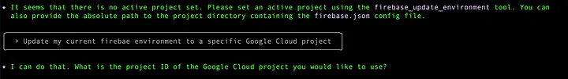
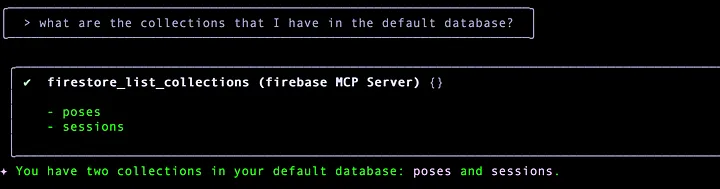
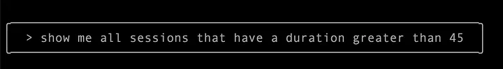
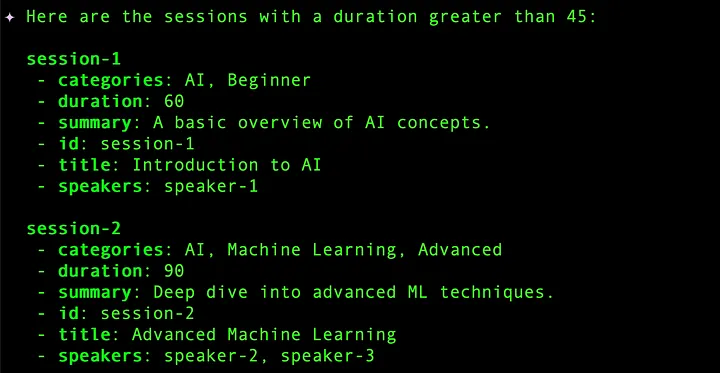

# 1. Firebase MCP Server
The documentation for Firebase MCP Server is [here](https://firebase.google.com/docs/ai-assistance/mcp-server#setup).

You can use the Firebase MCP server to give AI-powered development tools the ability to work with your Firebase projects and your app's codebase.

The Firebase MCP server works with any tool that can act as an MCP client, including: Firebase Studio, Gemini CLI and Gemini Code Assist, Claude Code and Claude Desktop, Cline, Cursor, VS Code Copilot, Windsurf, and more!

The Firebase MCP Server has a dependence on the Firebase CLI, so we will assume here that you are aware of the Firebase CLI and will need to have it available locally since you must authenticate with the CLI, before using the MCP Server.

**The instruction to do that is:**
```bash
npx -y firebase-tools@latest login --reauth
```

When you run the above command, it will open up a browser window for you to authenticate the account that you wish to use with Firebase. Go ahead, give it the necessary permissions and you should ideally see a page like this:



<br>

Add the following entry to the .gemini/settings.json file in the home directory.

```bash
{
  "mcpServers": {
    "firebase": {
      "command": "npx",
      "args": [
        "-y",
        "firebase-tools@latest",
        "experimental:mcp"
      ]
    }
  },
  "security": {
    "auth": {
      "selectedType": "oauth-personal"
    }
  },
  "ui": {
    "theme": "Default"
  }
}
```

I have a few Firebase projects that I had created as part of this account, so my first step is just to check a few basic things:
<br>



<br>

And it does give out a list of Firebase projects. The key to working with a Firebase project would be to set the correct environment locally with Firebase initialization done, etc. So I ask about my current environment and it comes back well saying that the current directory has none of that initialized.
<br>


<br>

So I ask it to initialize Firebase in the current directory and it goes ahead and does that.
<br>


<br>

I also had to set the current environment to point to a Google Cloud Project that was created for the Firebase project. The sample interaction is shown below:

<br>



<br>

I then gave it my Google Cloud Project Id and then it invoked the firebase_update_environment tool to set the project.

I query on the collections that I have and all the records in one of the collections:
<br>



<br>

I then fire a query that filters the sessions that have a duration greater than 45 mins. I give the following prompt:

<br>



The results are fetched and shown below:
<br>




If you are working with Firebase and wish to use Gemini CLI + Firebase MCP Server, do check out this codelab titled “Firebase MCP in Firebase Studio”. While the tool is Firebase Studio, you can go to Step 4 and try out the various scenarios/prompts.


