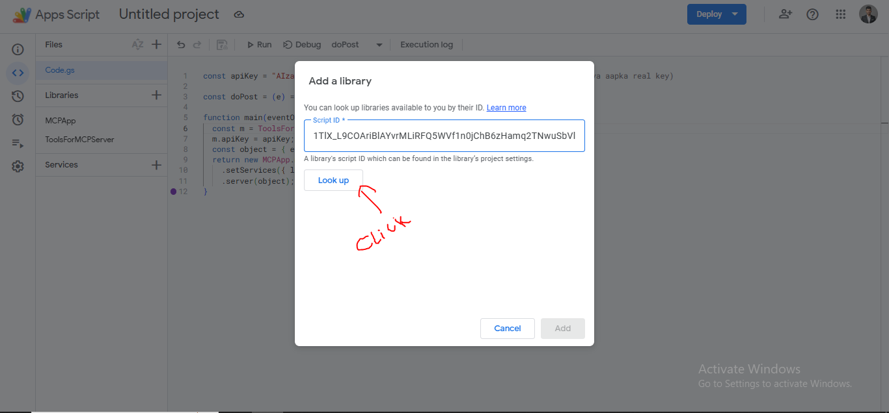
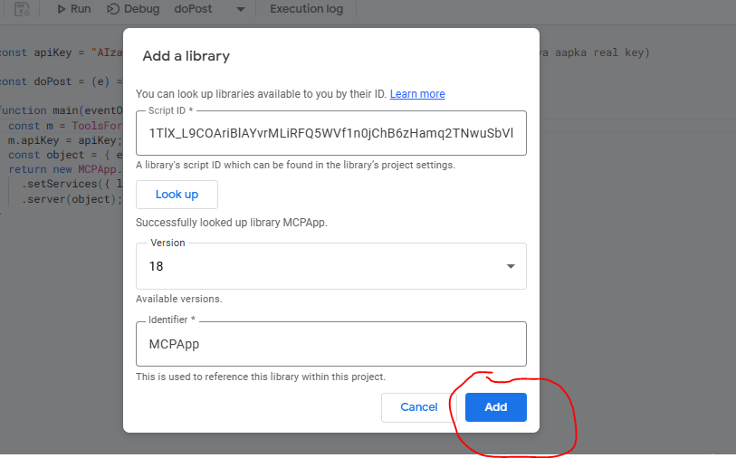
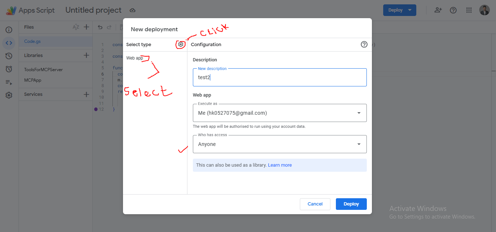
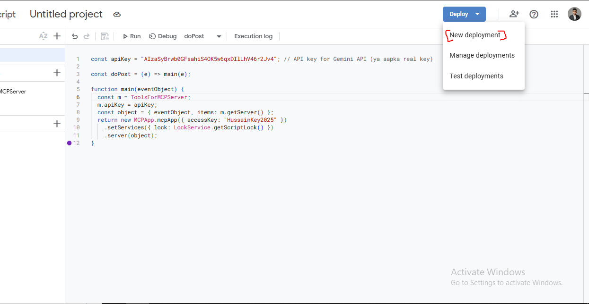
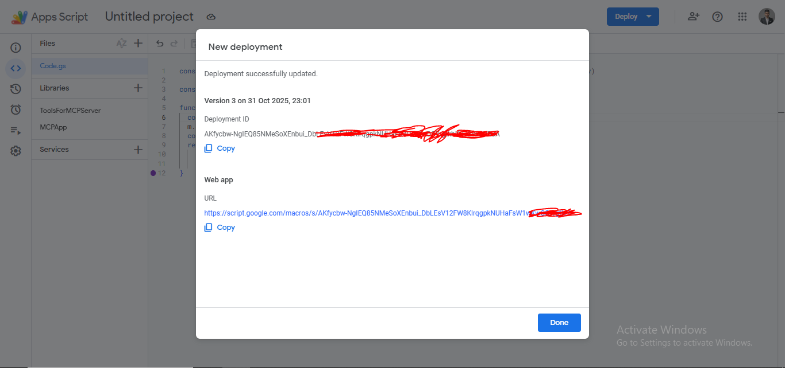

## Gemini CLI with MCP Server: Expanding Possibilities with Google Apps Script

[Go To Artical](https://medium.com/google-cloud/gemini-cli-with-mcp-server-expanding-possibilities-with-google-apps-script-4626c661ac81)

---

## Step 1

#### 1. go to https://script.google.com/

<br>

#### 2. Create App

<br>

#### 3. Paste Script in (code.gs)
  ```bash
  const apiKey = ""; // API key for Gemini API (ya aapka real key)

const doPost = (e) => main(e);

function main(eventObject) {
  const m = ToolsForMCPServer;
  m.apiKey = apiKey;
  const object = { eventObject, items: m.getServer() };
  return new MCPApp.mcpApp({ accessKey: "HussainKey2025" })
    .setServices({ lock: LockService.getScriptLock() })
    .server(object);
}
```

---


## Step 2 Click to Libraries Add a library

| Library Name      | Identifier        | Full Script ID (Project Key)                              | Repository                                                                                       |
| ----------------- | ----------------- | --------------------------------------------------------- | ------------------------------------------------------------------------------------------------ |
| MCPApp            | MCPApp            | 1TlX_L9COAriBlAYvrMLiRFQ5WVf1n0jChB6zHamq2TNwuSbVlI5sBUzh | [https://github.com/tanaikech/MCPApp](https://github.com/tanaikech/MCPApp)                       |
| ToolsForMCPServer | ToolsForMCPServer | 1lnE7UL1jQgPDbTB9yjhiwZM0SaS9MObhzvWUWb_t8FisO6A3bLepvM2j | [https://github.com/tanaikech/ToolsForMCPServer](https://github.com/tanaikech/ToolsForMCPServer) |

#### Add MCPApp library 
<br>



<br>

 


#### Add MCPApp ToolsForMCPServer 
* same as MCPApp but use name (ToolsForMCPServer) or (1lnE7UL1jQgPDbTB9yjhiwZM0SaS9MObhzvWUWb_t8FisO6A3bLepvM2j)

---

## Step 3 Deploy Project on (Wep App)

<br>

 

<br>



#### Click to Authorized Button and (login With Google Account)

#### Copy Web Url



---

## Step 4 settings.json

```bash
{
  "ide": { "hasSeenNudge": true },
  "mcpServers": {
    "gas_web_apps": {
      "command": "npx",
      "args": [
        "mcp-remote",
        "https://script.google.com/macros/s/AKfycbx6Dx7P8-S9XD-YmMy0kCjRuTgkL5h_Varjyn8SYQ/exec?accessKey=HussainKey2025"
      ],
      "env": {},
      "timeout": 30000
    }
  },
  "security": { "auth": { "selectedType": "oauth-personal" } },
  "ui": { "theme": "Default" }
}
```

## Test Project in Gemini Cli
```bash
gas_web_apps - Ready (149 tools, 3 prompts)
  Tools:
  - add_label_to_Gmail
  - analytics_admin_accountSummaries_list
  - analytics_admin_properties_get
  - analytics_data_properties_runRealtimeReport
  - analytics_data_properties_runReport
  - auto_new_draft_creation_Gmail
  - auto_reply_draft_creation_Gmail
  - change_permission_of_file_on_google_drive
  - classroom_courses_aliases_create
  - classroom_courses_aliases_delete
  - classroom_courses_aliases_list
  - classroom_courses_announcements_create
  - classroom_courses_announcements_delete
  - classroom_courses_announcements_get
  - classroom_courses_announcements_list
  - classroom_courses_announcements_modifyAssignees
  - classroom_courses_announcements_patch
  - classroom_courses_courseWork_create
  - classroom_courses_courseWork_delete
  - classroom_courses_courseWork_get
  - classroom_courses_courseWork_list
  - classroom_courses_courseWork_modifyAssignees
  - classroom_courses_courseWork_patch
  - classroom_courses_courseWork_rubrics_create
  - classroom_courses_courseWork_rubrics_delete
  - classroom_courses_courseWork_rubrics_get
  - classroom_courses_courseWork_rubrics_list
  - classroom_courses_courseWork_rubrics_patch
  - classroom_courses_courseWork_studentSubmissions_get
  - classroom_courses_courseWork_studentSubmissions_list
  - classroom_courses_courseWork_studentSubmissions_patch
  - classroom_courses_courseWork_studentSubmissions_reclaim
  - classroom_courses_courseWork_studentSubmissions_return
  - classroom_courses_courseWork_studentSubmissions_turnIn
  - classroom_courses_courseWorkMaterials_create
  - classroom_courses_courseWorkMaterials_delete
  - classroom_courses_courseWorkMaterials_get
  - classroom_courses_courseWorkMaterials_list
  - classroom_courses_courseWorkMaterials_patch
  - classroom_courses_create
  - classroom_courses_get
  - classroom_courses_getGradingPeriodSettings
  - classroom_courses_list
  - classroom_courses_patch
  - classroom_courses_remove
  - classroom_courses_students_create
  - classroom_courses_students_delete
  - classroom_courses_students_get
  - classroom_courses_students_list
  - classroom_courses_teachers_create
  - classroom_courses_teachers_delete
  - classroom_courses_teachers_get
  - classroom_courses_teachers_list
  - classroom_courses_topics_create
  - classroom_courses_topics_delete
  - classroom_courses_topics_get
  - classroom_courses_topics_list
  - classroom_courses_topics_patch
  - classroom_courses_update
  - classroom_courses_updateGradingPeriodSettings
  - classroom_invitations_accept
  - classroom_invitations_create
  - classroom_invitations_get
  - classroom_invitations_list
  - classroom_invitations_remove
  - classroom_registrations_create
  - classroom_registrations_delete
  - classroom_userProfiles_get
  - classroom_userProfiles_guardianInvitations_create
  - classroom_userProfiles_guardianInvitations_get
  - classroom_userProfiles_guardianInvitations_list
  - classroom_userProfiles_guardianInvitations_patch
  - classroom_userProfiles_guardians_get
  - classroom_userProfiles_guardians_list
  - classroom_userProfiles_guardians_remove
  - comments_drive_api_list
  - comments_drive_api_remove
  - convert_mimetype_of_file_on_google_drive
  - create_chart_on_google_sheets
  - create_charts_as_image_on_google_sheets
  - create_document_body_in_google_docs
  - create_file_to_google_drive
  - create_google_docs_from_markdown_on_google_drive
  - create_schedule_on_Google_Calendar
  - delete_schedules_on_Google_Calendar
  - description_video_on_youtube
  - description_web_site
  - drive_activity_api_query
  - explanation_analytics_data_properties_runRealtimeReport
  - explanation_analytics_data_properties_runReport
  - explanation_create_chart_by_google_sheets_api
  - explanation_create_maps_url
  - explanation_generate_quiz_with_google_forms
  - explanation_generate_survey_with_google_forms
  - explanation_google_apps_script_library_list
  - explanation_manage_google_docs_using_docs_api
  - explanation_manage_google_sheets_using_sheets_api
  - explanation_manage_google_slides_using_slides_api
  - explanation_reference_export_google_sheets_as_pdf
  - explanation_reference_generate_google_apps_script
  - explanation_search_file_in_google_drive
  - generate_description_on_google_drive
  - generate_image_on_google_drive
  - generate_presentation_with_google_slides
  - generate_quiz_with_google_forms
  - generate_roadmap_to_google_sheets
  - generate_survey_with_google_forms
  - get_attachment_files_from_Gmail
  - get_charts_on_google_sheets
  - get_current_date_time
  - get_current_weather
  - get_exchange_rate
  - get_file_from_google_drive
  - get_google_doc_object_using_docs_api
  - get_google_sheet_object_using_sheets_api
  - get_google_slides_object_using_slides_api
  - get_massages_by_search_from_Gmail
  - get_massages_by_time_from_Gmail
  - get_specific_date_weather
  - get_values_from_google_docs
  - get_values_from_google_sheets
  - manage_google_docs_using_docs_api
  - manage_google_sheets_using_sheets_api
  - manage_google_slides_using_slides_api
  - maps_convert_lat_lon_to_location
  - maps_convert_location_to_lat_lon
  - maps_create_map
  - maps_get_route
  - move_files_on_google_drive
  - people_connections_list
  - people_contactGroups_list
  - people_otherContacts_list
  - people_otherContacts_search
  - people_people_getBatchGet
  - publicly_share_file_on_google_drive
  - put_file_to_google_drive
  - put_values_into_google_docs
  - put_values_to_google_sheets
  - remove_files_on_google_drive
  - remove_mails_Gmail
  - rename_files_on_google_drive
  - revisions_drive_api_list
  - search_file_in_google_drive
  - search_schedule_on_Google_Calendar
  - search_values_from_google_sheets
  - send_mails_Gmail
  - summarize_file_on_google_drive
  - update_chart_on_google_sheets
  - update_schedule_on_Google_Calendar
  Prompts:
  - generate_roadmap
  - get_weather
  - search_files_on_google_drive
  ```
---


### Debug Steps:
* Run this command on Terminal 

npx mcp-remote WEB_APP_URL?accessKey=HussainKey2025

<br>

WEB_APP_URL?accessKey=HussainKey2025


